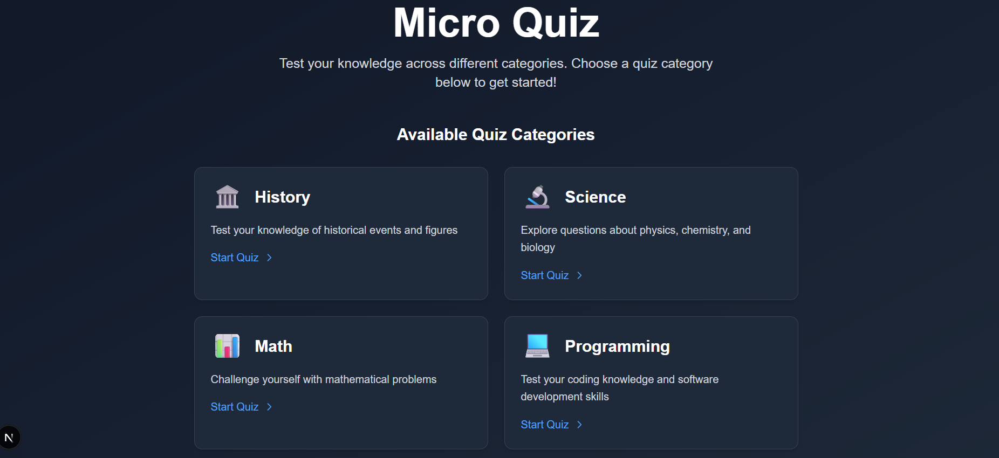
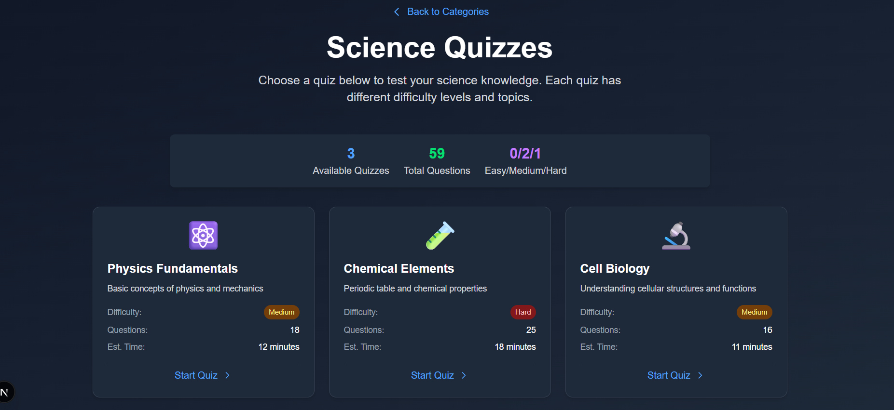
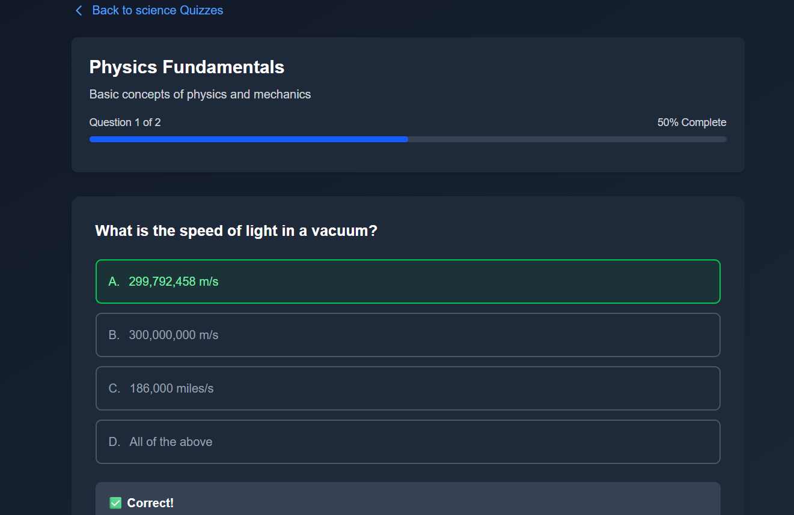
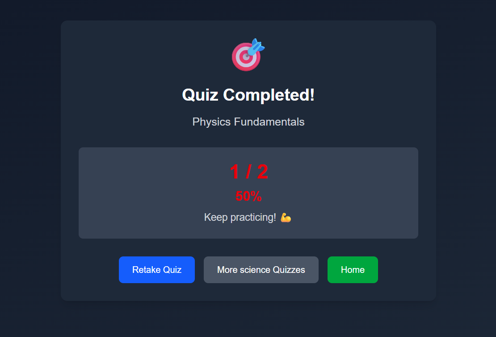

# Micro Quiz - Next.js Interactive Quiz Application

A modern, responsive quiz application built with Next.js 14, featuring dynamic routing, server-side rendering, and optimized image handling. Test your knowledge across multiple categories including History, Science, Math, and Programming.

## Features

- 🎯 **Interactive Quiz Experience** - Take quizzes with immediate feedback and scoring
- 📱 **Responsive Design** - Works seamlessly on desktop and mobile devices
- 🌙 **Dark Mode Support** - Automatic dark/light theme switching
- 🚀 **Optimized Performance** - Server-side rendering and image optimization
- 📊 **Progress Tracking** - Visual progress bars and completion statistics
- 🏆 **Score System** - Detailed scoring with percentage and feedback messages

### 🎥 Live Application


### 📱 Key Features
| Quizzes | Quiz Interface | Results |
|----------|----------------|---------|
|  |  |  |


## Tech Stack

- **Framework**: Next.js 14 with App Router
- **Language**: TypeScript
- **Styling**: Tailwind CSS
- **State Management**: React useReducer
- **Image Optimization**: next/image component

## Getting Started

### Prerequisites

- Node.js 18+ 
- npm, yarn, pnpm, or bun

### Installation

1. **Clone the repository**
   ```bash
   git clone <your-repo-url>
   cd micro-quiz
   ```

2. **Install dependencies**
   ```bash
   npm install
   # or
   yarn install
   # or
   pnpm install
   ```

3. **Run the development server**
   ```bash
   npm run dev
   # or
   yarn dev
   # or
   pnpm dev
   # or
   bun dev
   ```

4. **Open your browser**
   
   Navigate to [http://localhost:3000](http://localhost:3000) to see the application.

## Project Structure

```
micro-quiz/
├── app/
│   ├── api/
│   │   ├── categories/
│   │   │   └── route.ts              # Categories API endpoint
│   │   ├── quizzes/
│   │   │   └── [category]/
│   │   │       └── route.ts          # Category-specific quizzes API
│   │   └── quiz/
│   │       └── [category]/
│   │           └── [id]/
│   │               └── route.ts      # Individual quiz API
│   ├── quiz/
│   │   └── [category]/
│   │       ├── page.tsx              # Quiz category listing page
│   │       ├── not-found.tsx         # Category not found page
│   │       └── [id]/
│   │           ├── page.tsx          # Individual quiz page
│   │           ├── QuizInterface.tsx # Client-side quiz component
│   │           └── not-found.tsx     # Quiz not found page
│   ├── globals.css                   # Global styles
│   ├── layout.tsx                    # Root layout
│   └── page.tsx                      # Homepage
├── public/
│   └── images/                       # Optimized images directory
├── README.md
└── package.json
```

## Next.js Implementation Details

### 1. Static Site Generation (SSG)
- **Homepage** (`app/page.tsx`): Pre-generated at build time with `cache: 'force-cache'`
- **Quiz Categories**: Statically generated for optimal performance
- Implemented using `fetch()` with caching strategies

### 2. Server-Side Rendering (SSR)
- **Individual Quiz Pages**: Server-side rendered for immediate content availability
- **Quiz Category Pages**: Dynamic content fetched on each request with `cache: 'no-store'`
- Ensures fresh data and better SEO

### 3. API Routes
```typescript
// Categories API
GET /api/categories

// Category-specific quizzes
GET /api/quizzes/[category]

// Individual quiz data
GET /api/quiz/[category]/[id]
```
- RESTful API design with mock JSON data
- Proper error handling and 404 responses
- TypeScript interfaces for type safety

### 4. Dynamic Routing
- **Category Pages**: `/quiz/[category]` - Lists all quizzes in a category
- **Individual Quizzes**: `/quiz/[category]/[id]` - Interactive quiz interface
- Automatic 404 handling for invalid routes

### 5. Image Optimization
- **next/image component** used throughout the application
- Automatic format optimization (WebP when supported)
- Responsive image loading with proper sizing
- Priority loading for above-the-fold images

### 6. Client-Side State Management
- **useReducer** for complex quiz state management
- Real-time progress tracking and answer validation
- Immediate feedback system with explanations

## Design Decisions

### Architecture Choices

1. **App Router over Pages Router**: Chosen for better file organization and modern Next.js patterns
2. **TypeScript**: Ensures type safety and better development experience
3. **Tailwind CSS**: Rapid styling with consistent design system
4. **Component-based Architecture**: Separation of server and client components

### State Management

- **Server Components**: For data fetching and initial page renders
- **Client Components**: For interactive quiz functionality
- **useReducer**: Chosen over useState for complex quiz state with multiple actions

### Performance Optimizations

- **Image Optimization**: All images served via next/image
- **Code Splitting**: Automatic with Next.js App Router
- **Caching Strategy**: Strategic use of cache headers for different content types
- **Optimistic UI**: Immediate visual feedback for user interactions

## Challenges and Solutions

### 1. **Dynamic Routing with Type Safety**
**Challenge**: Ensuring type safety with dynamic route parameters
**Solution**: Created comprehensive TypeScript interfaces and proper error handling

### 2. **State Management Complexity**
**Challenge**: Managing quiz progress, answers, and feedback states
**Solution**: Implemented useReducer with well-defined action types for predictable state updates

### 3. **Server vs Client Component Balance**
**Challenge**: Deciding when to use server vs client components
**Solution**: Server components for data fetching, client components for interactivity

### 4. **Image Loading Performance**
**Challenge**: Slow image loading affecting user experience
**Solution**: Implemented next/image with proper sizing and priority attributes

## AI Development Process

This project was developed with assistance from AI coding tools, which helped in:

### Code Generation
- **Component Structure**: AI helped scaffold React components with proper TypeScript types
- **API Route Design**: Generated RESTful API endpoints with error handling
- **CSS Classes**: Automated Tailwind class combinations for consistent styling

### Problem Solving
- **Debugging**: AI assistance in identifying performance bottlenecks
- **Best Practices**: Guidance on Next.js 14 App Router patterns
- **Code Review**: Suggestions for optimization and clean code practices

### Learning Acceleration
- **Next.js Features**: Understanding of SSG, SSR, and API route implementations
- **TypeScript Patterns**: Learning advanced typing for React components
- **Performance Optimization**: Image optimization and caching strategies

## Available Scripts

```bash
# Development
npm run dev          # Start development server
npm run build        # Build for production
npm run start        # Start production server
npm run lint         # Run ESLint
npm run type-check   # Check TypeScript types
```

## Future Enhancements

- [ ] User authentication and progress saving
- [ ] Database integration for persistent quiz data
- [ ] Quiz creation interface for administrators
- [ ] Leaderboard and social features
- [ ] Advanced analytics and reporting
- [ ] Multi-language support

## Contributing

1. Fork the repository
2. Create a feature branch (`git checkout -b feature/amazing-feature`)
3. Commit your changes (`git commit -m 'Add amazing feature'`)
4. Push to the branch (`git push origin feature/amazing-feature`)
5. Open a Pull Request

## License

This project is licensed under the MIT License - see the [LICENSE](LICENSE) file for details.

## Acknowledgments

- Built with [Next.js](https://nextjs.org/)
- Styled with [Tailwind CSS](https://tailwindcss.com/)
- Icons from [Heroicons](https://heroicons.com/)
- Development accelerated with AI coding assistance